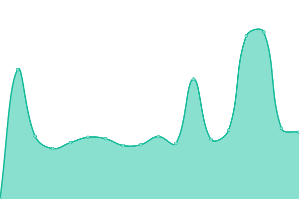
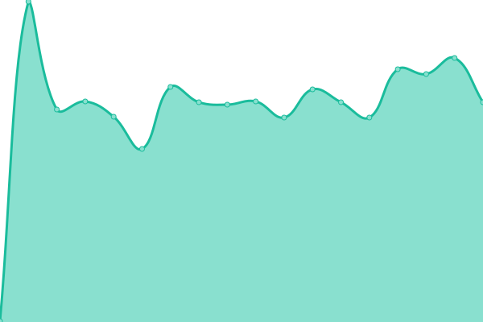

# [📈 Live Status](https://KasperE1.github.io/hcestatus): <!--live status--> **🟩 All systems operational**

This repository contains the open-source uptime monitor and status page for [Kasper](https://KasperE1.github.io/hcestatus), powered by [Upptime](https://github.com/upptime/upptime).

With [Upptime](https://upptime.js.org), you can get your own unlimited and free uptime monitor and status page, powered entirely by a GitHub repository. We use [Issues](https://github.com/KasperE1/hcestatus/issues) as incident reports, [Actions](https://github.com/KasperE1/hcestatus/actions) as uptime monitors, and [Pages](https://KasperE1.github.io/hcestatus) for the status page.

<!--start: status pages-->
<!-- This summary is generated by Upptime (https://github.com/upptime/upptime) -->
<!-- Do not edit this manually, your changes will be overwritten -->
<!-- prettier-ignore -->
| URL | Status | History | Response Time | Uptime |
| --- | ------ | ------- | ------------- | ------ |
|  [High Coast Esports](https://www.highcoastesports.com/) | 🟩 Up | [high-coast-esports.yml](https://github.com/KasperE1/hcestatus/commits/HEAD/history/high-coast-esports.yml) | 

 865ms
     
 | 

<a href="https://KasperE1.github.io/hcestatus/history/high-coast-esports">100.00%</a>
    

|  [Esportal](https://esportal.com/) | 🟩 Up | [esportal.yml](https://github.com/KasperE1/hcestatus/commits/HEAD/history/esportal.yml) | 

 278ms
     
 | 

<a href="https://KasperE1.github.io/hcestatus/history/esportal">100.00%</a>
    

|  [Steam Store](https://store.steampowered.com/) | 🟩 Up | [steam-store.yml](https://github.com/KasperE1/hcestatus/commits/HEAD/history/steam-store.yml) | 

 646ms
     
 | 

<a href="https://KasperE1.github.io/hcestatus/history/steam-store">100.00%</a>
    

<!--end: status pages-->

[**Visit our status website →**](https://KasperE1.github.io/hcestatus)

## 📄 License

- Powered by: [Upptime](https://github.com/upptime/upptime)
- Code: [MIT](./LICENSE) © [Kasper](https://KasperE1.github.io/hcestatus)
- Data in the `./history` directory: [Open Database License](https://opendatacommons.org/licenses/odbl/1-0/)
